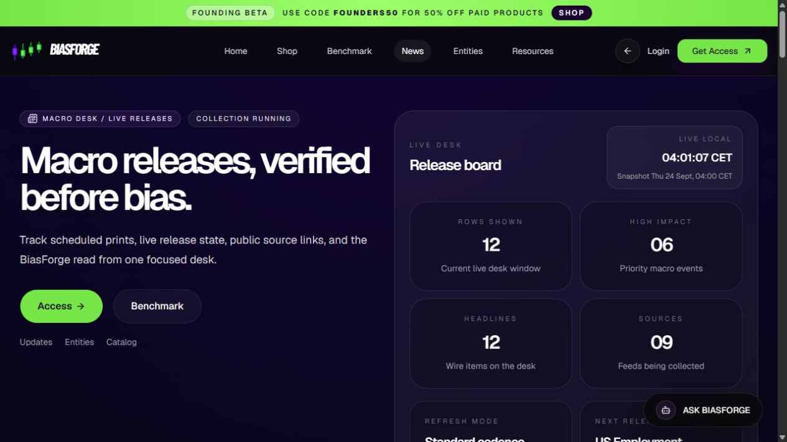

# BiasForge

A market-research workspace connecting chart tools, macroeconomic releases,
benchmark comparisons, and trade-review workflows.

[Product website](https://biasforge.com/) ·
[Explore the news workspace](https://biasforge.com/news) ·
[Project background](https://majdbenchobba.github.io/biasforge.html)

*Public workspace capture, 24 September 2026. Displayed counts and offers are
a dated UI snapshot; current access, coverage, and data freshness are shown in
the application.*

## A research workflow

1. Open the news desk and select the calendar window.
2. Inspect an event's release state, available actual/forecast values, and source links.
3. Distinguish a scheduled event from a confirmed release, and check the last successful sync.
4. Use the [benchmark workspace](https://biasforge.com/benchmark) and chart tools
   as additional research context.

The interface keeps source evidence and freshness indicators visible. A
scheduled event or stale feed should not be treated as a confirmed current print.

## Current status

**Public beta.** Features and access can change; some capabilities require an
account or product access. This overview makes no guarantee of trading returns,
complete market coverage, or production readiness. Benchmark results require
review and do not establish future trading performance.

## About this repository

This is a public product overview. Application source, trading logic, credentials,
research records, and operational data remain private.
